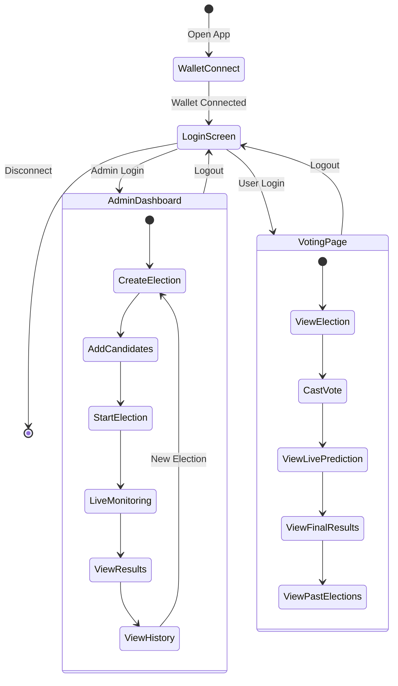

# Blockchain Voting System - Frontend

React-based web application for interacting with the blockchain voting system.

## 📁 Structure

```
frontend/
├── src/
│   ├── pages/              # Main pages
│   │   ├── AdminDashboard.jsx
│   │   └── VotingPage.jsx
│   ├── App.jsx             # Main app component
│   ├── Voting.json         # Contract ABI
│   └── main.jsx            # Entry point
├── public/                 # Static assets
├── .env                    # Environment variables
└── package.json            # Dependencies
```

## 🚀 Setup

1. **Install Dependencies**
```bash
npm install
```

2. **Configure Environment**
   - Create `.env` file
   - Add contract address:
   ```
   VITE_CONTRACT_ADDRESS=0x...
   ```

3. **Start Development Server**
```bash
npm run dev
```

4. **Open Browser**
   - Navigate to `http://localhost:5173`
   - Connect MetaMask wallet

## ✨ Features

### Admin Dashboard
- ✅ Create unlimited elections
- ✅ Add candidates to elections
- ✅ Start/end elections
- ✅ View live predictions
- ✅ Access complete election history
- ✅ View detailed results

### Voting Page
- ✅ View current election
- ✅ Cast votes securely
- ✅ See live vote counts
- ✅ View election history
- ✅ Check past results

## 🎨 User Interface Flow



## 🔐 Authentication

**Demo Credentials:**
- Admin: `admin` / `admin` (requires owner wallet)
- User: `user` / `user`

## 🛠️ Tech Stack

- React 18
- React Native Web (for styling)
- React Router DOM (routing)
- Ethers.js (blockchain interaction)
- Vite (build tool)

## 📦 Build

**Production Build:**
```bash
npm run build
```

**Preview Build:**
```bash
npm run preview
```

## 🌐 MetaMask Setup

1. Install MetaMask browser extension
2. Connect to localhost network
3. Import test account from Hardhat
4. Connect wallet to app
