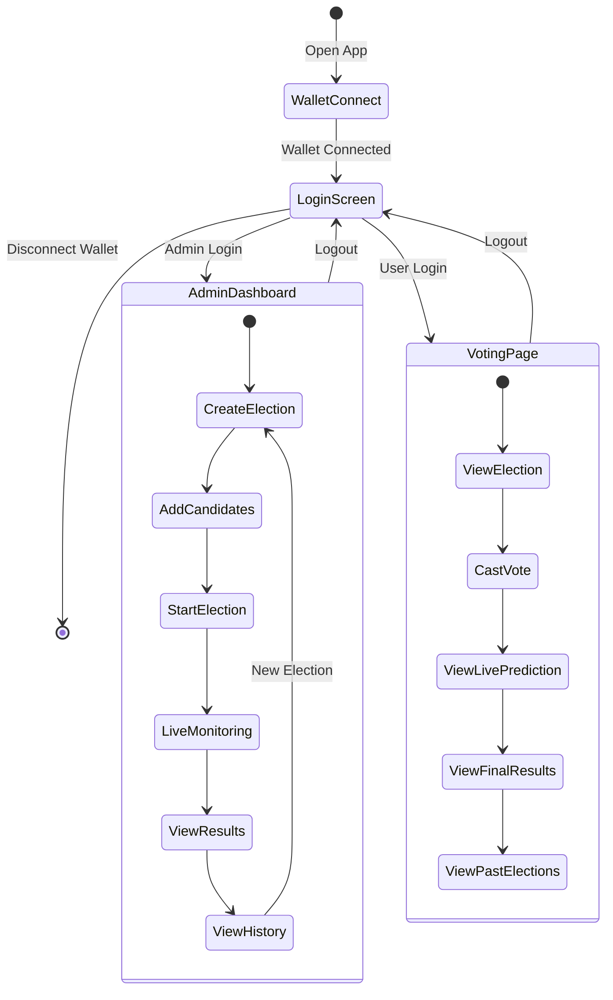

# 🎨 Blockchain Voting System - Frontend

Modern React-based web application for interacting with the blockchain voting system, built with React Native Web and Vite.

## 📋 Overview

This frontend provides an intuitive, responsive interface for both administrators and voters to interact with the blockchain voting system. Built with React Native Web for cross-platform compatibility and styled with a modern dark theme.

## 📁 Project Structure

```
frontend/
├── src/
│   ├── components/            # Reusable UI components
│   │   └── CandidateCard.tsx
│   ├── hooks/                 # Custom React hooks
│   │   ├── useContract.ts    # Contract interaction logic
│   │   └── useElection.ts    # Election management logic
│   ├── pages/                 # Main application pages
│   │   ├── AdminDashboard.tsx
│   │   └── VotingPage.tsx
│   ├── types/                 # TypeScript type definitions
│   │   ├── contract.ts
│   │   └── index.ts
│   ├── utils/                 # Utility functions
│   │   ├── constants.ts
│   │   └── formatters.ts
│   ├── App.tsx                # Main app component with routing
│   ├── main.tsx               # Application entry point
│   └── vite-env.d.ts          # Vite type definitions
├── public/                    # Static assets
├── .env                       # Environment variables (gitignored)
├── .env.example               # Example environment file
├── vite.config.ts             # Vite configuration
├── tsconfig.json              # TypeScript configuration
├── package.json               # Dependencies
└── README.md                  # This file
```

## 🚀 Quick Start

### Prerequisites

- Node.js v18 or higher
- npm or yarn
- MetaMask browser extension
- Running Hardhat node (backend)

### Installation

```bash
# Install dependencies
npm install
```

### Configuration

1. **Create Environment File**

```bash
cp .env.example .env
```

2. **Update Contract Address**

Edit `.env` file:

```env
VITE_CONTRACT_ADDRESS=0x5FbDB2315678afecb367f032d93F642f64180aa3
VITE_DEMO_ADMIN_USER=admin
VITE_DEMO_ADMIN_PASS=admin
VITE_DEMO_USER_USER=user
VITE_DEMO_USER_PASS=user
```

Replace the contract address with your deployed contract address from the backend.

### Start Development Server

```bash
npm run dev
```

**Output:**
```
  VITE v7.3.0  ready in 289 ms

  ➜  Local:   http://localhost:5173/
  ➜  Network: use --host to expose
```

### Open Application

1. Navigate to `http://localhost:5173`
2. Connect your MetaMask wallet
3. Login with demo credentials

## ✨ Features

### 🔐 Wallet Integration

- **MetaMask Connection** - Seamless wallet integration
- **Network Detection** - Automatic network validation
- **Account Switching** - Real-time account updates
- **Balance Display** - ETH balance tracking

### 👨‍💼 Admin Dashboard

- ✅ **Create Elections** - Unlimited election creation
- ✅ **Add Candidates** - Dynamic candidate management
- ✅ **Start Elections** - Set custom duration in minutes
- ✅ **End Elections** - Manual election termination
- ✅ **Live Predictions** - Real-time vote tracking
- ✅ **Election History** - Complete historical records
- ✅ **Detailed Results** - Comprehensive result views

### 🗳️ Voting Page

- ✅ **View Active Election** - Current election display
- ✅ **Cast Votes** - One-click voting with MetaMask
- ✅ **Live Vote Counts** - Real-time vote updates
- ✅ **Vote Percentages** - Visual vote distribution
- ✅ **Election Timer** - Countdown to election end
- ✅ **Past Elections** - Historical election browser
- ✅ **Result Viewing** - Detailed past results

### 🎨 User Interface

- ✅ **Modern Dark Theme** - Eye-friendly design
- ✅ **Responsive Layout** - Mobile and desktop support
- ✅ **Real-time Notifications** - Success/error alerts
- ✅ **Loading States** - Clear feedback during operations
- ✅ **Intuitive Navigation** - Easy-to-use interface
- ✅ **Accessible Components** - WCAG compliant

## 🎨 User Interface Flow



## 🔐 Authentication

### Demo Credentials

| Role  | Username | Password | Required Account |
|-------|----------|----------|------------------|
| Admin | `admin`  | `admin`  | Contract Owner (Account #0) |
| User  | `user`   | `user`   | Any Account |

**⚠️ Important:** 
- Admin login only works with the contract owner wallet
- User login works with any connected wallet
- These are demo credentials for development only

## 🛠️ Tech Stack

### Core Technologies

- **React** 18.3 - UI framework
- **TypeScript** - Type-safe development
- **Vite** 7.3 - Fast build tool and dev server
- **React Router DOM** 7.1 - Client-side routing

### Blockchain Integration

- **Ethers.js** v6 - Ethereum library
- **MetaMask** - Wallet provider

### UI Components

- **React Native Web** - Cross-platform components
- **Custom Hooks** - Reusable logic
- **Context API** - State management

## 🔨 Development Commands

### Start Dev Server

```bash
npm run dev
```

Starts Vite dev server with hot module replacement.

### Build for Production

```bash
npm run build
```

Creates optimized production build in `dist/` directory.

### Preview Production Build

```bash
npm run preview
```

Serves the production build locally for testing.

### Type Check

```bash
npm run type-check
```

Runs TypeScript compiler to check for type errors.

### Lint Code

```bash
npm run lint
```

Runs ESLint to check code quality.

## 🌐 MetaMask Setup Guide

### 1. Install MetaMask

1. Visit [metamask.io](https://metamask.io/)
2. Download and install browser extension
3. Create new wallet or import existing
4. Save recovery phrase securely

### 2. Add Hardhat Network

1. Open MetaMask
2. Click network dropdown (top)
3. Select "Add Network" → "Add network manually"
4. Enter details:

```
Network Name: Hardhat Localhost
RPC URL: http://127.0.0.1:8545
Chain ID: 31337
Currency Symbol: ETH
```

5. Click "Save"

### 3. Import Test Accounts

**Admin Account (Account #0):**
```
Private Key: 0xac0974bec39a17e36ba4a6b4d238ff944bacb478cbed5efcae784d7bf4f2ff80
```

**User Accounts:**
```
Account #1: 0x59c6995e998f97a5a0044966f0945389dc9e86dae88c7a8412f4603b6b78690d
Account #2: 0x5de4111afa1a4b94908f83103eb1f1706367c2e68ca870fc3fb9a804cdab365a
```

To import:
1. MetaMask → Account icon → "Import Account"
2. Paste private key
3. Click "Import"

### 4. Connect to App

1. Open app at `http://localhost:5173`
2. Click "Connect Wallet"
3. Approve connection in MetaMask
4. Switch to Hardhat Localhost network if needed

## 📱 Application Routes

| Route    | Component       | Access      | Description |
|----------|----------------|-------------|-------------|
| `/`      | Login Screen   | Public      | Wallet connection and login |
| `/admin` | Admin Dashboard| Admin Only  | Election management |
| `/vote`  | Voting Page    | User Only   | Voting interface |

## 🎯 Key Components

### Custom Hooks

#### `useContract()`
Manages blockchain connection and contract interaction.

**Returns:**
- `contract` - Contract instance
- `account` - Connected wallet address
- `isAdmin` - Whether user is contract owner
- `connectWallet()` - Function to connect wallet
- `disconnectWallet()` - Function to disconnect

#### `useElection(contract, electionId)`
Manages election state and operations.

**Returns:**
- `election` - Election data
- `candidates` - Candidate list
- `loading` - Loading state
- `error` - Error state
- `refetch()` - Refresh data

### Pages

#### `AdminDashboard.tsx`
Complete admin interface for election management.

**Features:**
- Create elections
- Add candidates
- Start/end elections
- View live results
- Access history

#### `VotingPage.tsx`
User interface for voting and viewing results.

**Features:**
- View active election
- Cast votes
- See live counts
- Browse history

## 🔧 Configuration Files

### `vite.config.ts`
Vite build configuration with React Native Web alias.

### `tsconfig.json`
TypeScript compiler options and path mappings.

### `.env`
Environment variables (gitignored):
- `VITE_CONTRACT_ADDRESS` - Deployed contract address
- Demo credentials

## 🚨 Troubleshooting

### Contract Address Issues

**Problem:** "Contract not found" error

**Solution:**
1. Check `.env` has correct contract address
2. Restart dev server: `Ctrl+C` then `npm run dev`
3. Hard refresh browser: `Ctrl+Shift+R`

### MetaMask Connection

**Problem:** Wallet not connecting

**Solution:**
1. Ensure MetaMask is installed and unlocked
2. Switch to Hardhat Localhost network
3. Refresh page and try again

### Transaction Failures

**Problem:** "Transaction failed" error

**Solution:**
1. Check sufficient ETH balance
2. Verify correct network (Chain ID: 31337)
3. Clear MetaMask activity data (Settings → Advanced)

### Admin Access

**Problem:** "You are not the admin account!" error

**Solution:**
1. Ensure using Account #0 (contract owner)
2. Switch accounts in MetaMask
3. Logout and login again

## 📦 Build Output

Production build creates:
- Optimized JavaScript bundles
- Minified CSS
- Source maps
- Static assets

Deploy `dist/` folder to:
- Vercel
- Netlify
- GitHub Pages
- Any static hosting

## 🔄 Development Workflow

1. **Start backend** - Run Hardhat node
2. **Deploy contract** - Get contract address
3. **Update .env** - Set contract address
4. **Start frontend** - Run dev server
5. **Connect wallet** - MetaMask connection
6. **Test features** - Admin and user flows

## 📖 Additional Resources

- [React Documentation](https://react.dev/)
- [Vite Documentation](https://vitejs.dev/)
- [Ethers.js v6 Docs](https://docs.ethers.org/v6/)
- [React Native Web](https://necolas.github.io/react-native-web/)
- [MetaMask Docs](https://docs.metamask.io/)

## 🤝 Contributing

When contributing to the frontend:
1. Follow TypeScript best practices
2. Use existing component patterns
3. Add proper error handling
4. Test with MetaMask
5. Ensure responsive design

## 📄 License

MIT License - See LICENSE file for details

---

**Part of the Blockchain Voting System** | [Main README](../README.md) | [Backend README](../backend/README.md)
